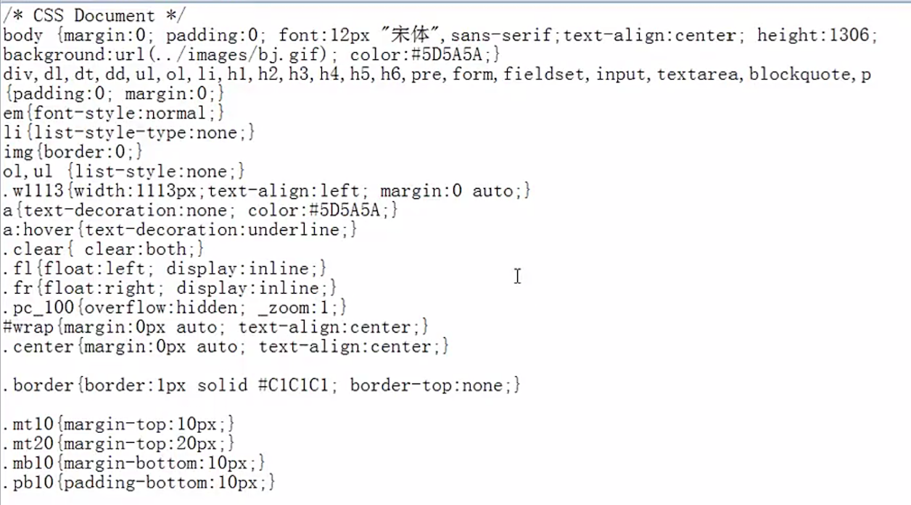

# 网站制作
### 网页基本框架的构建  
#### div + css 的盒子模型
    
* [margin](http://www.zhangxinxu.com/wordpress/2009/08/css-margin的相关属性，问题及应用/)  
 > 使用 `margin: 0 auto;` 的时候，必须要给定一个宽度  
* padding    

> [MARGIN和PADDING中四个值的先后顺序及区别](http://my.clicknow.cn/post/85/)  
[使用CSS中margin和padding的基础和注意事项](http://blog.sina.com.cn/s/blog_673ee2b50100lxrb.html)

#### float  
* [原理即使用方法](http://blog.csdn.net/qq_20404903/article/details/49024247)  
* [css清除浮动float的三种方法总结](http://my.oschina.net/leipeng/blog/221125)  
* [CSS float浮动的深入研究、详解及拓展(一)](http://www.zhangxinxu.com/wordpress/2010/01/css-float浮动的深入研究、详解及拓展一/)  
* [CSS float浮动的深入研究、详解及拓展(二)](http://www.zhangxinxu.com/wordpress/2010/01/css-float浮动的深入研究、详解及拓展二/)  

#### 常见网站的布局  
[6种常见布局](http://www.missyuan.com/thread-698280-1-1.html)

### 页面logo及菜单布局  
> * 因格式需要，经常会用到的一段前端代码：    
    
* [css中font-family中文字体](http://www.cnblogs.com/mofish/archive/2012/12/06/2805617.html)  
* [html css特殊字符表](http://blog.csdn.net/bluestarf/article/details/40652011)

#### [position](http://www.cnblogs.com/yinc/articles/2017649.html)  
* relative
* absolute  

#### 菜单  
###### 主菜单    
使用列表标签  
```ruby  
<ul>
 <li>...</li>
 <li>...</li>
 <li>...</li>
 ...
</ul>
```
###### 二级菜单  
* div + css 实现      
 * js实现对象的显示隐藏功能  
 * 鼠标控制函数  
 `onmouseout` 和 `onmouseover`  
* ...

#### banner设计  
* flash实现  
添加flash插件播放代码  
* div + css + js  
 * [setInterval()](http://www.jb51.net/shouce/htmldom/jb51.net.htmldom/htmldom/met_win_setinterval.asp.html)  
