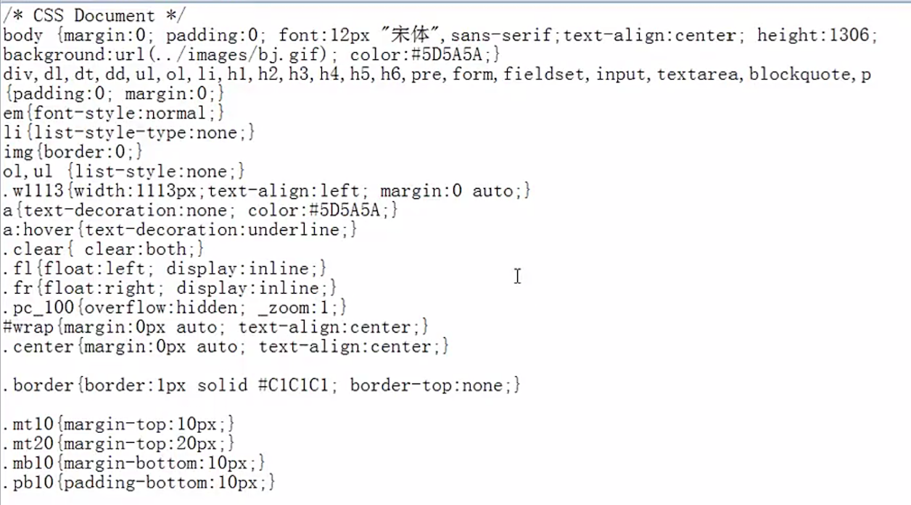
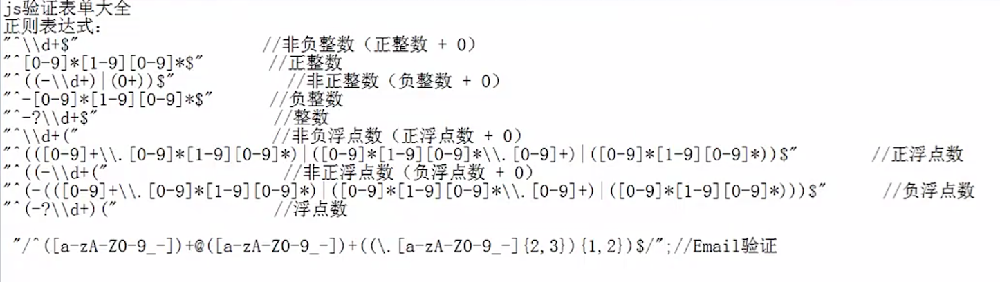
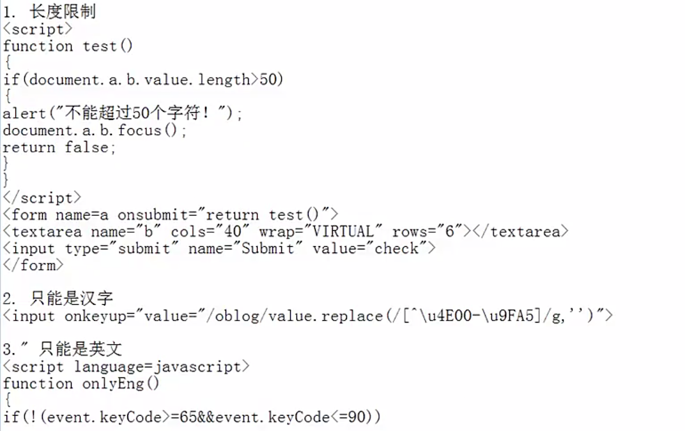

# 网站制作
### 网页基本框架的构建  
#### div + css 的盒子模型
    
* [margin](http://www.zhangxinxu.com/wordpress/2009/08/css-margin的相关属性，问题及应用/)  

> * 使用 `margin: 0 auto;` 的时候，必须要给定一个宽度  
* `span` 中的文字居中方法：    
 要想居中，首先得有宽度；  
 而span是inline，只给width是不起作用的；要想起作用，得先让span变成inline-block：  
  
  ```ruby  
  span{
  display:inline-block;
  width:100px;
  text-align:center;
  }  
  ```

* padding    

> [MARGIN和PADDING中四个值的先后顺序及区别](http://my.clicknow.cn/post/85/)  
[使用CSS中margin和padding的基础和注意事项](http://blog.sina.com.cn/s/blog_673ee2b50100lxrb.html)

#### float  
* [原理即使用方法](http://blog.csdn.net/qq_20404903/article/details/49024247)  
* [css清除浮动float的三种方法总结](http://my.oschina.net/leipeng/blog/221125)  
* [CSS float浮动的深入研究、详解及拓展(一)](http://www.zhangxinxu.com/wordpress/2010/01/css-float浮动的深入研究、详解及拓展一/)  
* [CSS float浮动的深入研究、详解及拓展(二)](http://www.zhangxinxu.com/wordpress/2010/01/css-float浮动的深入研究、详解及拓展二/)  

#### 常见网站的布局  
[6种常见布局](http://www.missyuan.com/thread-698280-1-1.html)

### 页面logo及菜单布局  
> * 因格式需要，经常会用到的一段前端代码：    
    
* [css中font-family中文字体](http://www.cnblogs.com/mofish/archive/2012/12/06/2805617.html)  
* [html css特殊字符表](http://blog.csdn.net/bluestarf/article/details/40652011)

#### [position](http://www.cnblogs.com/yinc/articles/2017649.html)  
* relative
* absolute  

#### 菜单  
###### 主菜单    
使用列表标签  
```ruby  
<ul>
 <li>...</li>
 <li>...</li>
 <li>...</li>
 ...
</ul>
```
###### 二级菜单  
* div + css 实现      
 * js实现对象的显示隐藏功能  
 * 鼠标控制函数  
 `onmouseout` 和 `onmouseover`  
* ...

#### banner设计  
* flash实现  
添加flash插件播放代码  
* div + css + js  
 * [setInterval()](http://www.jb51.net/shouce/htmldom/jb51.net.htmldom/htmldom/met_win_setinterval.asp.html)  
 * ...

#### 无缝滚动模块设计  
* [marquee: 滚动标签](http://www.360doc.com/content/14/1210/17/9060464_431831883.shtml)  
* [div + css + js 进行界面设计](http://xueshu.baidu.com/s?wd=paperuri%3A%28e0c9a39353f65a7eef122c199f4af607%29&filter=sc_long_sign&tn=SE_xueshusource_2kduw22v&sc_vurl=http%3A%2F%2Fwww.doc88.com%2Fp-9972307152205.html&ie=utf-8&sc_us=13252124571412439245)  
 * offsetWidth: 对象可视宽度  
 * scrollLeft: 对象的滚动条距离  
  设计原理: 利用scrollLeft不断累加的方式实现

 > [补充参考](http://www.w3school.com.cn/xmldom/dom_htmlelement.asp)  
  [table相关属性](http://www.w3school.com.cn/tags/att_table_cellpadding.asp)  
  [参考源码（图片无缝滚动＋鼠标悬停控制功能）](http://zhidao.baidu.com/link?url=qk-UksCD2Al2NjzxVb7V8wpZkL7PrucQ826uV2nBsi5R8mqe0WPuBozoaVrMBkiY7iTvhM5CewWlQ5BNbOUPzK)  
  [参考源码（文字无缝滚动）](http://www.codefans.net/jscss/code/2759.shtml)  

#### 视频添加  
* [embed标签](http://www.w3school.com.cn/tags/tag_embed.asp)  

> [尝试发现最新版本的safari不支持，需改用video标签](https://support.apple.com/zh-cn/HT205081)  

* [video标签](http://www.jianshu.com/p/404d01b8e713)  

> * [video标签 属性](http://www.cnblogs.com/kiter/archive/2013/02/25/2932157.html)  
* [目前支持的三种格式](http://www.runoob.com/tags/tag-video.html)  

#### 在线咨询  
* QQ链接代码  
前提：必须装有QQ客户端  

```ruby
href="http://wpa.qq.com/msgrd?V=1&amp;uin=你的QQ号&amp;Site=www.maiziedu.com&amp;Menu=yes"
```

```ruby  
href="tencent://message/?uin=要链接的QQ号"   
```  

```ruby  
href="tencent://message/?uin=要链接的QQ号&Site=&Menu=yes"  
```

* 属性    
 `document.body.scrollTop`  
 `document.documentElement.scrollTop`

* 设计原理  
 * 固定图片在body中的位置：position: absolute  
 * 动态获取滚动条的位置 ＋ 原来的位置高度：(document.body.scrollTop+)document.documentElement.scrollTop+图片原来定义的top值+"px"  
 * 重新设置新的位置高度  
 * 通过事件触发调用  

 >   
 [相关属性的详细介绍](http://blog.csdn.net/fswan/article/details/17238933)

* 核心代码  
```ruby  
window.onload = window.onresize = window.onscroll = function(){
  var qqbox = document.getElementById("consultbox");
  var qq = document.getElementById("consult");
  var sc_top = document.documentElement.scrollTop || document.body.scrollTop;  
  setTimeout(function(){
    clearInterval(qqbox.timer);
    var itop = parseInt((document.documentElement.clientHeight - qqbox.offsetHeight)/2) + sc_top;
    qqbox.timer = setInterval(function(){
      var ispeed = (sc_top - qqbox.offsetTop) / 8;
      ispeed = ispeed > 0 ? Math.ceil(ispeed) : Math.floor(ispeed);
      qqbox.offsetTop == sc_top ? clearInterval(qqbox.timer) : (qqbox.style.top = qqbox.offsetTop + ispeed + "px");
    },30)
  },100)
}  
```
[参考案例](http://js.alixixi.com/a/2011071572504.shtml#)

#### 分页符  
[参考](http://www.html5tricks.com/tag/分页插件)  

#### 留言页面布局及验证  
* 设计表格   
 * div + css  
 * table  
 `textarea` 不能设置宽度，只能通过 `行：rows="..." 列：cols="..."` 实现  
* 基本验证非空  

```ruby  
function test(){
  if(document.getElementById("username").value == "" || document.getElementById("username").value == NaN){
    alert("username can't be empty!");
    return false;
  }
  else {
    return true;
  }
}  
```  

* （正则表达式）验证  
[match(): 字符串匹配函数](http://www.w3school.com.cn/jsref/jsref_match.asp)  
  

[知道这 20 个正则表达式，能让你少写 1,000 行代码](http://gold.xitu.io/entry/571807a88ac247005f117209/promote?utm_source=baidu&utm_medium=keyword&utm_content=regexp&utm_campaign=q3_search)  
[正则表达式基本语法](http://www.cnblogs.com/light169/archive/2006/10/18/532347.html)  
[正则表达式语法及常用的正则表达式](http://blog.csdn.net/gongth_12/article/details/8606814)
